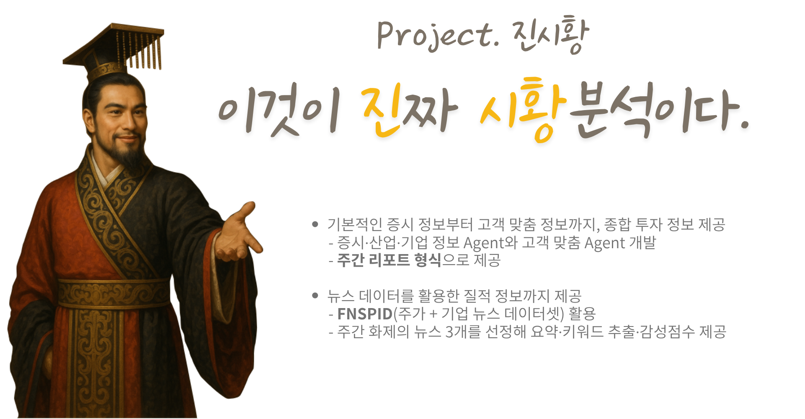
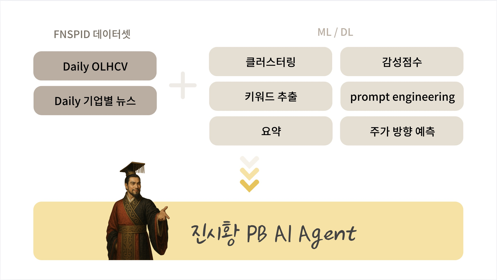
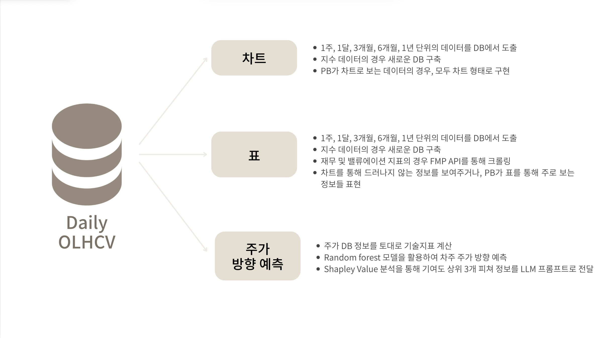
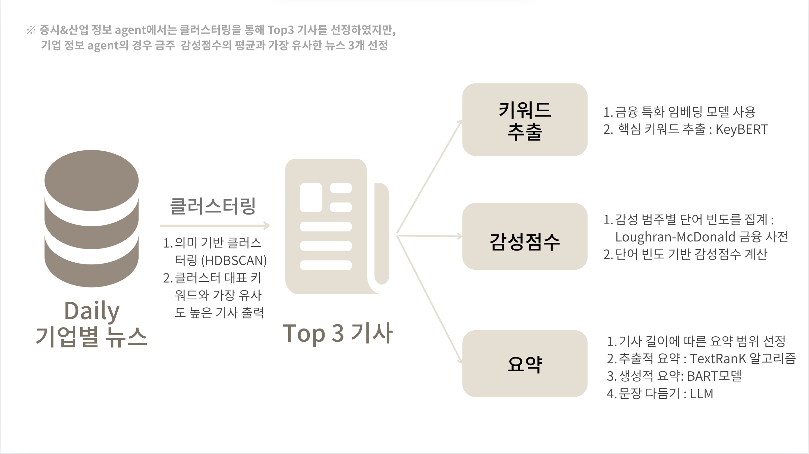

# KB_PB_Agent_AI_JinShiWang

>### **Project. JinShiWang: 이것이 <span style="color: #D4B96A">진</span>짜 <span style="color: #D4B96A">시황</span> 분석이다.**
우리가 구현 PB Agent AI인 JinShiWang은 기본적인 증시 정보부터 고객 맞춤 정보까지, 종합 투자 정보를 제공합니다.

증시·산업·기업 정보 Agent와 고객 맞춤 Agent를 개발하여 **주간 리포트 형식**으로 정보를 제공합니다.
또한, 뉴스 데이터를 활용한 질적 정보까지 제공하며, **FNSPID**(주가 + 기업 뉴스 데이터셋)를 활용합니다. 주간 화제의 뉴스 3개를 선정해 요약, 키워드 추출, 감성점수까지 함께 제공합니다.

<p align="center">
  
</p>

## 프로젝트 개요

JinShiWang은 PB(Private Banker) 업무의 효율성과 고객 만족도를 높이기 위해 설계된 AI 기반 에이전트 시스템입니다.  
이 프로젝트는 PB가 고객에게 제공하는 투자 정보와 시장 분석을 자동화·지능화하여, 맞춤형 리포트와 인사이트를 신속하게 전달할 수 있도록 지원합니다.

- **AI Agent는 프라이빗 뱅커의 정보원 역할**을 하며, 데이터 수집·처리·분석을 통해 맞춤형 서비스 제공을 위한 기초 자료를 제공합니다.
- PB는 AI Agent가 정리한 자료를 검토하고, 이를 고객에게 전달하는 데 집중할 수 있습니다.
- 기존의 단순 자료 제공을 넘어, **고객 포트폴리오별 시장 정보 분석**, **주가 데이터와 뉴스의 통합적 이해**, **비용 효율적 아키텍처 설계**를 목표로 합니다.

---

## 프로젝트 목적

1. **PB용 시황 분석·예측 AI Agent 개발**  
   - 고객 포트폴리오를 개별적으로 분석하고, 관련 시장 정보를 제공하는 Agent를 개발합니다.

2. **FNSPID(금융 뉴스와 주가를 통합한 오픈 소스 데이터셋) 활용**  
   - 주가 데이터(정량적 지표)와 뉴스(정성적 지표)를 연동해, 증시 및 산업에 대한 통합적 이해를 지원합니다.

3. **LLM 의존도 최소화 및 비용 절감**  
   - ML/DL 모델과 시각화 기술을 결합하여, <span style="color: #D4B96A">LLM에 대한 의존도가 낮은 Agent</span>를 설계합니다.

4. **고객 맞춤형 업데이트 제공**  
   - PB가 고객에게 맞춤형 업데이트를 제공함으로써, 고객 만족도 향상을 기대합니다.

5. **AI Agent의 역할**  
   - 주어진 정보를 스스로 분석하고, 상황에 맞는 판단이나 작업을 수행하는 지능형 소프트웨어로서, PB의 업무 효율화와 고객 서비스 고도화를 동시에 추구합니다.


## 주요 기능
<p align="center">
  
</p>

- **감정 분석**: 입력된 텍스트의 감정(긍정/부정/중립 등)을 자동으로 분류
- **클러스터링**: 유사한 텍스트 데이터를 그룹화하여 주제별로 분류
- **감성 점수 산출**: 각 텍스트의 감정 강도를 수치로 산출
- **키워드 추출**: 텍스트에서 핵심 키워드 자동 추출
- **요약**: 긴 텍스트를 간결하게 요약
- **개인화 지식 베이스 구축**: 분석 결과를 바탕으로 사용자별 지식 그래프 생성

---

## 기술 스택

- **프론트엔드**: React, JavaScript, HTML/CSS
- **백엔드**: Python (FastAPI)
- **AI/ML**: Hugging Face Transformers, scikit-learn, spaCy
- **데이터베이스**: PostgreSQL, Google Cloud SQL
- **배포/인프라**: Google Cloud Platform (Cloud Run, Cloud Storage, Cloud CDN), GitHub Actions

---

## 정량 데이터 처리 개요

>본 서비스의 정량 데이터 분석은 FNSPID 데이터셋 내의 OHLCV(시가, 고가, 저가, 종가, 거래량) 데이터를 기반으로 수행됩니다.

<p align="center">
  
</p>

- DB에서 다양한 기간(1주, 1달, 3개월, 6개월, 1년)의 데이터를 조회하여 차트 및 표로 시각화합니다.
- 지수 데이터, 재무 및 밸류에이션 지표는 별도 DB 구축 및 외부 API(FMP 등) 호출을 통해 추가 수집합니다.
- 주가 방향 예측은 DB의 OHLCV 기반 기술지표를 산출하여, Random Forest 모델의 입력값으로 활용합니다.
- Shapley Value 분석을 통해 예측에 기여도가 높은 상위 3개 피처를 선정하고, 해당 정보를 LLM 프롬프트에 입력하여 자연어 코멘트(설명)를 생성합니다.


## ML/DL 기반 세부 기능별 처리 절차
<p align="center">
  
</p>


### 1. 클러스터링

- **목적**: 증시 및 산업 정보 Agent에 들어갈 "전 주의 Hot한 기사 Top3"를 선정하기 위함
- **파이프라인**: BERTopic 파이프라인을 사용하여 문서 임베딩 → 차원 축소(UMAP) → 클러스터링(HDBSCAN) → 키워드 추출(c-TF-IDF, MMR) 과정을 거침
- **세부 과정**:
  1. **문장 임베딩**: 기사 등 문서를 임베딩(BERT 등)하여 벡터화
  2. **차원 축소**: UMAP을 통해 임베딩 차원 축소
  3. **클러스터링**: HDBSCAN(밀도 기반 계층적 클러스터링)으로 의미적으로 유사한 문서 그룹화
  4. **키워드 추출**: 각 클러스터별로 c-TF-IDF로 대표 키워드 추출, MMR로 대표성 높은 문서 선정
  5. **대표 기사 선정**: 키워드 기반으로 유사한 대표 기사 3개를 출력

- **HDBSCAN**: 밀도 기반 계층적 클러스터링 알고리즘으로, 데이터의 밀집도를 활용해 클러스터를 자동으로 탐지함
- **BERTopic 파이프라인**:  
  - Embed Documents → UMAP → HDBSCAN → c-TF-IDF → MMR  
  - 다양한 임베딩 기법(BERT 등) 사용 가능, 클러스터별로 의미 있는 주제와 대표 문서 도출

### 2. 감성 점수 산출

- **목적**: 뉴스 기사에 감성 점수를 생성하여 시장 심리 파악에 활용
- **방법**: 각 기사 본문을 전처리한 뒤, Loughran-McDonald 금융 감성 사전과 대조하여 단어별 감성 카운트
- **점수 계산**: 단어 빈도수를 기반으로 감성 점수를 산출  
  - 공식:  
    $$
    \text{Sentiment Score} = \frac{Count_{positive} - Count_{negative} - Count_{uncertainty} - Count_{litigious} - Count_{constraining}}{Count_{total}}
    $$
- **점수 범위**: -1 ~ +1

### 3. 키워드 추출

- **목적**: 뉴스 기사에서 핵심 키워드 제시
- **방법**: 
  - 전처리 후, **KeyBERT**를 활용하여 MMR(Maximal Marginal Relevance) 기반 핵심 키워드 추출
  - 일정 토큰 단위로 나눠(KeyBERT 청킹 전략) 순차적으로 키워드 추출
  - 추출 전 spaCy로 개체명 인식(NER)을 수행하여, 추출된 키워드 내 고유명사를 원형으로 복원

### 4. 뉴스 기사 요약

- **목적**: 뉴스 기사 원문의 핵심 내용을 간결하게 요약하여 제공
- **프로세스**:
  1. **토큰 수 계산**: 기사 원문 입력 시 토큰 길이 측정
  2. **1차 요약(추출적 요약)**:  
     - 토큰 길이가 길 경우, TextRank 알고리즘을 활용해 핵심 문장 중심의 추출적 요약 수행
  3. **2차 요약(생성적 요약)**:  
     - Bart 등 사전학습 생성 요약 모델을 활용해 자연스러운 요약문 생성
  4. **후처리(GPT-3)**:  
     - 요약 결과를 GPT에 전달하여 프롬프트 기반 후처리 및 추가 요약/정제 가능

- **요약 방식**:  
  - 기사 길이와 목적에 따라 추출적 요약(TextRank)과 생성적 요약(Bart)을 단계적으로 적용  
  - 최종적으로 GPT-3를 활용해 요약 결과를 보완하거나, 프롬프트 기반 추가 후처리 가능


---

## 실행 및 배포 방법

1. **환경 설정**
   - Node.js, npm, Python 3.x 설치
   - (필요시) 가상환경 생성 및 패키지 설치

2. **프론트엔드 실행**
   ```bash
   cd frontend
   npm install
   npm start
   ```

3. **백엔드 실행**
   ```bash
   pip install -r requirements.txt
   uvicorn app.main:app --reload
   ```

4. **전체 서비스 연동**
   - 프론트엔드에서 API 주소를 백엔드 서버로 맞춰 연동

---

## 참고 자료

- [React 공식 문서](https://react.dev/)
- [Hugging Face Transformers](https://huggingface.co/transformers/)
- [scikit-learn 클러스터링](https://scikit-learn.org/stable/modules/clustering.html)